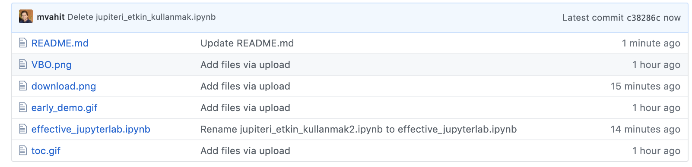

# Using JupyterLab Effectively (JupyterLab’ı etkin bir şekilde kullanma)

## Giriş

Merhabalar, bu notlar JupyterLab kullanımına yeni başlayanlar için önemli olabilecek bazı bilgileri içermektedir. 

Birçok konu ele alınmıştır ve denk geldikçe eklenmektedir. Ele alınan konulardan önemli ve öne çıkanlar:

- İçindekiler Bölümü Oluşturmak
- Tıklanabilir İçindekiler Bölümü Oluşturmak
- "Variable Explorer" Eklentisi Eklemek
- Resim ekleme işlemleri ile ilgili detaylı ayarlar
- Görsellerin kalitesini maksimum yapmak
- Notebook'un Başlangıç Dizinin Ayarlanması
- Decimal Ayarlaması (virgülden sonra görüntülenecek rakam miktarı)

Tüm içeriğe Github üzerinden erişmek ve incelemek için aşağıdaki görselde işaretlenen "effective_jupyterlab.ipynb" dosyasını çalıştırınız:

Önemli not: Bazı kodlar Github'a atıldığında derlendiği için en verimli şekilde gözlemlemek adına bilgisayarınıza indirerek inclenemesini öneririm.

## Kendi Bilgisayarınıza İndirip Kullanmak için

1. Bu çalışma dosyasında yer alan bilgileri doğru bir şekilde uygulayabilmek için aşağıdaki işaretli yerden bu repoyu (effective_jupyterlab) bilgisayarınıza indiriniz:

2. İndirmiş olduğunuz dosyayı zipten çıkarınız ve JupyterLab'ı açınız. 

3. Sonrasında JupyterLab üzerinden indirmiş olduğunuz dosyanın dizinine giderek "effective_jupyterlab.ipynb" dosyasını açınız. 

4. Açma işleminden sonra tüm markdown kodlarını ve diğer kodları daha kolay bir şekilde uygulayabileceksiniz.

